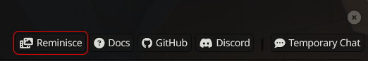
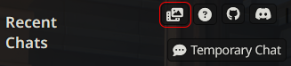
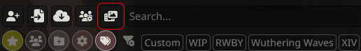
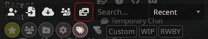
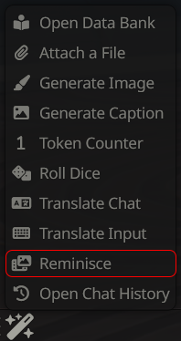

# The Garden of Recollection

The Garden of Recollection is an extension for SillyTavern that allows users to visit past chats with characters they haven't interacted with in a while as well as create new ones with said characters.

## Why the name?
> Black Swan: Through the course of one's existence, only a scant amount of impactful memories— pain, joy, rage, sorrow, can be harvested... The Garden of Recollection was conceived with the preservation of such memories in mind. To hear one's speech, to venture into their hearts, to glimpse through memories...

## Features
1. Weighted Random Selection: Compared to SillyTavern's default `/random` command, The Garden of Recollection uses a weighted random selection based on the amount of randomness you decide to use. The Garden of Recollection will select a character or group chat based on the randomness you set with lower randomness resulting in older or never used characters being selected and higher randomness resulting in a normal random selection.

2. New Random Chats: The Garden of Recollection allows you to create new random chats with characters based on the randomness you set. This means that you can create new chats with characters you haven't interacted with in a while or even never interacted with before.

3. Random Group Chat Support: The Garden of Recollection supports random group chats, allowing for older group chats to be selected based on the randomness you set. This means that you can revisit group chats and interact with characters you haven't spoken in that chat in a while.

## Usage

### Welcome Menu
When opening SillyTavern on your PC or phone, you will find the following *Reminisce* button in the Welcome Menu:

| Desktop | Mobile |
| :-----: | :----: |
|  | 

> [!NOTE]
> If you are using a heavily altered theme i.e. Moonlit Echoes or a custom [Guinevere UI Extension](https://github.com/Bronya-Rand/Guinevere-UI-Extension) theme, the *Reminisce* button on the welcome screen may be absent or moved to another location.

### Character Menu
When on the Character Management tab, you will find find the following *Reminisce* icon button below:

| Desktop | Mobile |
| :-----: | :----: |
|  |  |

> [!NOTE]
> If you are using a heavily altered theme i.e. Moonlit Echoes or a custom [Guinevere UI Extension](https://github.com/Bronya-Rand/Guinevere-UI-Extension) theme, the *Reminisce* button on the welcome screen may be absent or moved to another location.

### Wand Menu
When clicking on the Wand Button, you will find the following *Reminisce* button below:

<center>
    
</center>

### Slash Commands

`/reminisce` -  This command will select a random character or group chat based on the reminisce settings you have set.

`/reminisce-new` - This command will create a new random chat with a character based on the reminisce settings you have set.

`/set-recollection-mode <mode>` - This command will set the reminisce mode of the Garden of Recollection. The available modes are:

    - `none`: No reminisce mode is set.
    - `character`: The reminisce mode is set to character, meaning that the Garden of Recollection will select a random character based on the reminisce settings you have set.
    - `group`: The reminisce mode is set to group, meaning that the Garden of Recollection will select a random group chat based on the reminisce settings you have set.
    - `all`: The reminisce mode is set to all, meaning that the Garden of Recollection will select a random character or group chat based on the reminisce settings you have set.

## Prerequisites

- SillyTavern 1.13.0+

#### Via Download Extensions & Assets (Easiest)
> Coming soon (hopefully)

#### Via Install Extension

1. Click _Extensions_ then **Install Extension**
2. Paste in the following **link** into the text field and click Save:

   ```sh
   https://github.com/Bronya-Rand/Garden-Of-Recollection
   ```

3. Refresh the SillyTavern page.
4. Click on _Extensions_ again and click down on the `The Garden of Recollection` dropdown and select a reminisce setting of your choosing.
5. Profit.